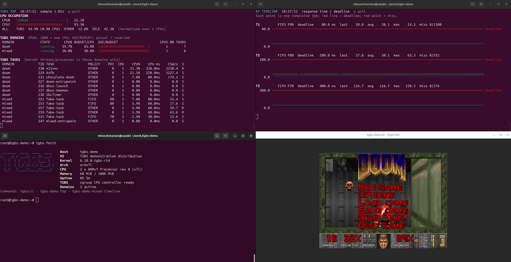

# TGBS Demo

Yocto-based demonstration of the **Task Group Bandwidth Server (TGBS)** on
QEMU ARM and the Digilent Zybo Z7. The image combines temporal CPU isolation,
mixed real-time workloads, live terminal monitoring, and a graphical Doom
workload in a compact, reproducible environment.



The screenshot shows the complete QEMU demonstration:

- `tgbs-demo-top` reports per-CPU occupation, TGBS domain budgets, and tasks;
- `tgbs-demo-mixed-timeline` plots RT response times against their deadlines;
- `tgbs-fetch` provides a compact summary of the target system;
- Chocolate Doom runs through Xvfb and is exposed over VNC.

## Demo Components

The generated image includes the following commands:

| Command | Purpose |
| --- | --- |
| `tgbsctl` | Create, inspect, update, freeze, and stop TGBS-managed cgroups. |
| `tgbs-demo-doom` | Run Doom inside the `doom` domain with a configurable temporal CPU contract. |
| `tgbs-demo-mixed` | Run the JSON-configured `mixed` domain containing FIFO RT tasks and FAIR background tasks. |
| `tgbs-demo-top` | Display CPU usage for TGBS domains and their internal tasks. |
| `tgbs-demo-mixed-timeline` | Plot RT response times on a shared time window with terminal Braille graphics and automatic vertical scales. |
| `tgbs-fetch` | Display target, kernel, CPU, memory, uptime, and TGBS information. |

## Targets

Currently supported:

* QEMU ARM (`qemuarm32`)
* Digilent Zybo Z7 / Zynq-7000 (`zybo-z7`)

The QEMU configuration matches the Zynq-7000 SoC: an ARMv7 (Cortex-A9) target with 2 virtual CPUs and 1 GiB of RAM, sharing the same CPU tune as the Zybo Z7 so both machines build with a single toolchain.

## Project Structure

```text
.
├── docs/
│   └── images/
├── kas/
│   ├── local.yml
│   ├── qemu.yml
│   ├── tgbs-demo.yml
│   └── zybo-z7.yml
├── src/
    ├── meta-openembedded/
    ├── meta-kdebug/
    ├── meta-tgbs/
    ├── meta-tgbs-demo/
    └── poky/
└── tools/
```

The kas configuration is split by responsibility:

* `kas/tgbs-demo.yml` — common demo and image configuration
* `kas/qemu.yml` — QEMU target configuration
* `kas/zybo-z7.yml` — Zybo Z7 target configuration
* `kas/local.yml` — local build host configuration

The Yocto layers are organized as follows:

* `meta-kdebug` — optional kernel configuration and GDB helpers
* `meta-tgbs` — reusable Yocto integration for TGBS
* `meta-tgbs-demo` — components and configuration specific to the demonstration
* `poky` and `meta-openembedded` — upstream Yocto/OpenEmbedded layers

## Build Host Configuration

The default local configuration uses shared Yocto download and sstate directories:

```text
/opt/yocto/downloads
/opt/yocto/sstate-cache
```

These paths are defined in `kas/local.yml` and may be adapted to the build host.

## Build

Build the QEMU image with:

```sh
kas build kas/tgbs-demo.yml:kas/qemu.yml:kas/local.yml
```

Build the Zybo Z7 image and its kernel device tree with:

```sh
kas build kas/tgbs-demo.yml:kas/zybo-z7.yml:kas/local.yml
```

The Zybo build deploys `boot.bin`, `u-boot.bin`, `zImage`,
`zynq-zybo-z7.dtb`, and the root filesystem. SD-card image assembly is not
automated yet.

## Run

Enter the configured Yocto build environment:

```sh
kas shell kas/tgbs-demo.yml:kas/qemu.yml:kas/local.yml
```

Then boot the image with:

```sh
runqemu qemuarm32 slirp nographic
```

The demo image allows direct root login without a password.

### Running the demonstration

After booting the target, start the two example domains from a control shell:

```sh
tgbs-demo-doom start &
tgbs-demo-mixed start &
```

Open two additional SSH sessions for the live monitors:

```sh
tgbs-demo-top
```

```sh
tgbs-demo-mixed-timeline
```

The default configuration places both workloads on CPU 1. Doom reserves 65%
of one CPU, while the mixed workload reserves 30%. The remaining CPU is left
available to the base system and the control tools. Run the system summary at
any time with:

```sh
tgbs-fetch
```

To view Doom, connect a VNC client to `localhost:5900` for QEMU or to
`192.168.10.2:5900` for the default Zybo Z7 configuration. The VNC endpoint
has no password and is intended only for the isolated demonstration network.

The contracts can be changed while the workloads are running. For example:

```sh
tgbs-demo-doom set runtime_us 50000
tgbs-demo-mixed set runtime_us 4000
tgbsctl list
tgbsctl inspect doom
```

Pause and resume either workload without stopping its domain:

```sh
tgbs-demo-doom pause
tgbs-demo-mixed pause
tgbs-demo-doom resume
tgbs-demo-mixed resume
```

Stop the workloads with:

```sh
tgbs-demo-doom stop
tgbs-demo-mixed stop
```

### SSH access

#### QEMU

With QEMU running in SLIRP mode, connect to the guest with:

```sh
./tools/ssh-qemu.sh
```

TCP port `2222` on the host is forwarded to SSH port `22` in the guest. Using
`2222` avoids conflicting with an SSH server already listening on port `22` of
the build host and does not require binding a privileged port.

QEMU images can generate a new SSH host key when a fresh root filesystem is
booted. `StrictHostKeyChecking=no` accepts that changing key, while
`UserKnownHostsFile=/dev/null` prevents ephemeral keys from being recorded in
the user's `known_hosts` file. These options disable SSH host authentication
and must therefore only be used for this local demonstration VM, not for a
remote or production target.

The script is equivalent to:

```sh
ssh -p 2222 -o StrictHostKeyChecking=no -o UserKnownHostsFile=/dev/null root@localhost
```

#### Zybo Z7

The Zybo Z7 uses the static address `192.168.10.2/24`. For a direct Ethernet
connection, configure the host interface and open an SSH session with:

```sh
./tools/ssh-zybo.sh <network-interface>
```

For example:

```sh
./tools/ssh-zybo.sh enp89s0
```

The interface name is an argument and is therefore not fixed by the project.
Use `nmcli device status` to find it. The script creates or updates a dedicated
NetworkManager connection named `tgbs-zybo-<network-interface>`, assigns
`192.168.10.1/24` to the host, and connects to `root@192.168.10.2`. The
connection is marked as never providing the host's default route.

As with the QEMU command above, SSH host key checking is disabled because a
newly flashed image can have a different host key. This is suitable for the
direct demonstration link only.

Alternative addresses and the SSH user can be selected without modifying the
script:

```sh
ZYBO_HOST_ADDRESS=192.168.20.1/24 \
ZYBO_TARGET_ADDRESS=192.168.20.2 \
ZYBO_TARGET_USER=root \
tools/ssh-zybo.sh enp89s0
```

The address configured in the Zybo Z7 image must use the same subnet. To remove
the host connection afterwards, run:

```sh
sudo nmcli connection delete tgbs-zybo-<network-interface>
```

## Kernel Debugging

The `meta-kdebug` layer enables the kernel debug information and GDB scripts
when the `kdebug` distribution feature is present. The `tgbs-demo`
distribution enables it by default.

Install the following host tools before starting a debug session:

* `gdb-multiarch`
* OpenOCD for the Zybo Z7 target
* the Cortex-Debug VS Code extension (`marus25.cortex-debug`)

The two ready-to-use configurations are provided in `.vscode/launch.json`.
Both use Cortex-Debug, with a different server mode for each backend. QEMU
already exposes a GDB remote stub, so Cortex-Debug connects to it as an
external server. The physical target is accessed through an OpenOCD instance
started and managed by Cortex-Debug.

### QEMU

Build the QEMU image, enter its build environment and start it:

```sh
kas build kas/tgbs-demo.yml:kas/qemu.yml:kas/local.yml
kas shell kas/tgbs-demo.yml:kas/qemu.yml:kas/local.yml
runqemu qemuarm32 nographic
```

When `kdebug` is enabled, `meta-kdebug` adds `-s` to the QEMU command line.
The GDB remote stub therefore listens on TCP port 1234. The **Attach QEMU**
configuration uses Cortex-Debug with `servertype: "external"` and connects to
this endpoint through `gdbTarget`. Select it in the VS Code Run and Debug view
to attach to the running kernel.

By default, `-s` does not stop the virtual CPU and the kernel starts before GDB
connects. To debug the earliest kernel code, add the following setting to a
`local_conf_header` block in `kas/tgbs-demo.yml`, then rebuild the image:

```yaml
local_conf_header:
  kernel-debug-stop: |
    KDEBUG_QEMU_ARGS = "-s -S"
```

QEMU will then wait for GDB before executing the first instruction. Continue
the target from the debugger after setting the required breakpoints.

### Zybo Z7

Build and boot the Zybo Z7 image, connect the Digilent JTAG adapter, then
select **Attach Zynq** in VS Code. The Cortex-Debug configuration starts
OpenOCD with these configuration files:

```text
interface/ftdi/digilent-hs1.cfg
target/zynq_7000.cfg
```

OpenOCD must therefore be available in `PATH`, and the current user must have
permission to access the JTAG adapter.

Cortex-Debug can also attach to an OpenOCD instance managed outside VS Code,
using the same external-server mode as the QEMU configuration. For that use
case, replace the managed OpenOCD settings with, for example:

```json
"servertype": "external",
"gdbTarget": "localhost:3333"
```

In external mode, Cortex-Debug connects to the supplied GDB endpoint and does
not start or configure OpenOCD itself.

### Linux GDB helpers

Both launch configurations load the generated `vmlinux` symbol file and
`vmlinux-gdb.py`. This Python script is produced by the Linux kernel build when
`CONFIG_GDB_SCRIPTS=y` and adds commands and convenience functions that
understand kernel data structures. The target normally needs to be stopped
while these commands inspect its memory.

Some useful commands are:

```gdb
(gdb) lx-dmesg
(gdb) lx-ps
(gdb) lx-lsmod
(gdb) lx-symbols
```

`lx-dmesg` prints the kernel log buffer directly from target memory, even when
no userspace shell or serial console is available. `lx-ps` walks the kernel
task list and displays the address, PID and name of each task. `lx-lsmod` lists
loaded modules, while `lx-symbols` loads or refreshes their symbols.

Use GDB itself to discover every helper supported by the kernel version being
debugged:

```gdb
(gdb) apropos lx
(gdb) help lx-dmesg
(gdb) help function lx_task_by_pid
```

The paths in `.vscode/launch.json` include the kernel recipe version and its
Yocto work directory. Update them if the kernel version, recipe name or target
machine changes.

## License

This project is licensed under the MIT License. See `LICENSE`.
